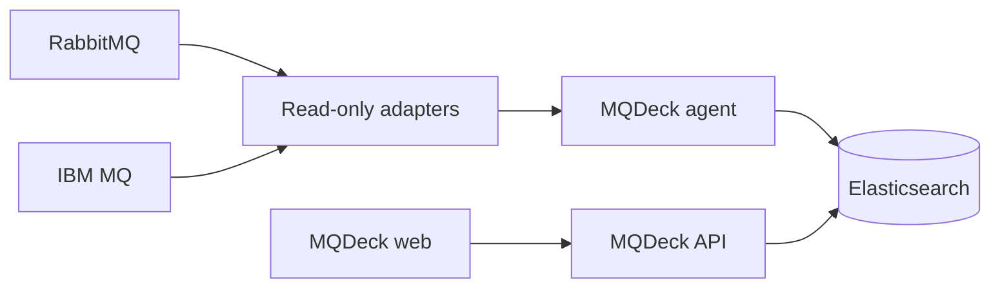

# MQDeck

MQDeck is a read-only observability platform for IBM MQ and RabbitMQ. It
collects bounded operational evidence next to, or remotely from, messaging
infrastructure and presents a normalized view of broker health, topology,
queues, channels, clients, and message flow.

MQDeck is designed around a strict separation between collection and query:
the agent writes evidence directly to Elasticsearch, while the API and web
interface only read it.



## Core principles

- **Read-only by construction.** HTTP integrations use `GET`; local commands
  are validated against narrow diagnostic allowlists.
- **Bounded collection.** Response sizes, execution time, concurrency, and
  capture frequency are controlled by configuration.
- **No API ingestion path.** The agent writes directly to Elasticsearch. The
  API exposes query endpoints only.
- **Credentials stay out of evidence.** Secrets are supplied through
  environment variables and are never written to host snapshots or evidence.
- **Broker-specific detail, one operator view.** Each adapter preserves the
  capabilities of its broker while the API normalizes the result for the UI.

## Repositories

| Repository | Responsibility |
| --- | --- |
| [`mqdeck`](https://github.com/mqdeck/mqdeck) | Platform overview and documentation |
| [`mqdeck-agent`](https://github.com/mqdeck/mqdeck-agent) | Scheduled evidence collection and Elasticsearch ingestion |
| [`mqdeck-api`](https://github.com/mqdeck/mqdeck-api) | Read-only query API and report normalization |
| [`mqdeck-web`](https://github.com/mqdeck/mqdeck-web) | Operator interface for hosts, reports, findings, and evidence |
| [`mqdeck-local`](https://github.com/mqdeck/mqdeck-local) | Docker Compose development environment and message simulator |
| [`mqdeck-adapter-ibmmq`](https://github.com/mqdeck/mqdeck-adapter-ibmmq) | IBM MQ REST and local-command collection adapter |
| [`mqdeck-adapter-rabbitmq`](https://github.com/mqdeck/mqdeck-adapter-rabbitmq) | RabbitMQ HTTP and local-command collection adapter |

## Get started locally

Clone the application repositories into the same parent directory because the
local development scripts expect this sibling layout:

```bash
mkdir mqdeck-workspace
cd mqdeck-workspace
git clone https://github.com/mqdeck/mqdeck-local.git
git clone https://github.com/mqdeck/mqdeck-agent.git
git clone https://github.com/mqdeck/mqdeck-api.git
git clone https://github.com/mqdeck/mqdeck-web.git
```

Start the broker and storage infrastructure:

```bash
cd mqdeck-local
make up
```

In a second terminal, start the agent, API, and web interface:

```bash
cd mqdeck-workspace/mqdeck-local
make dev
```

Open <http://localhost:3000>, then validate the environment with `make verify`.
The first startup can take several minutes, especially when IBM MQ runs through
`amd64` emulation on Apple Silicon.

The included credentials and relaxed TLS settings are for isolated local
development only. Do not expose the development environment to untrusted
networks.

## Documentation

- [Getting started](docs/getting-started.md)
- [Architecture](docs/architecture.md)
- [Configuration](docs/configuration.md)
- [Security policy](SECURITY.md)
- [Contributing](CONTRIBUTING.md)
- [OpenAPI contract](https://github.com/mqdeck/mqdeck-api/blob/main/openapi.yaml)

## Project status and licensing

MQDeck is under active development. Interfaces, configuration, and storage
schemas may change before the first stable release.

The repositories are publicly readable, but a project license has not yet been
selected. Public availability alone does not grant permission to copy, modify,
or redistribute the code beyond rights provided by applicable law.
