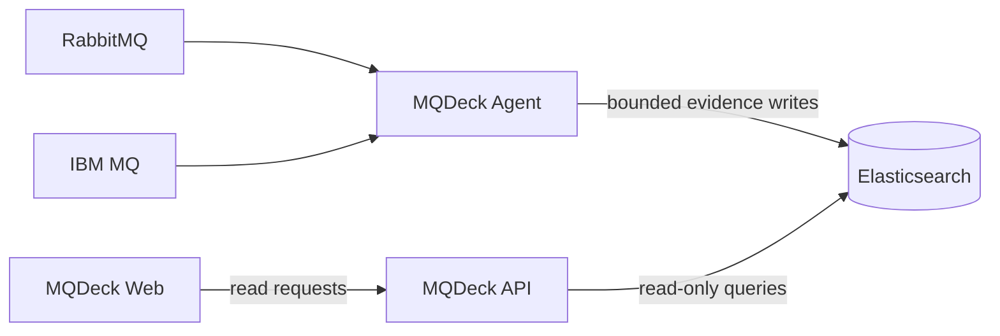

# MQDeck

MQDeck is a read-only observability platform for IBM MQ and RabbitMQ. This
public repository is the official binary distribution, installation, and
release documentation channel. Implementation repositories are private.

[](https://github.com/mqdeck/mqdeck/releases/latest)
[](LICENSE.md)

Visit the [MQDeck platform website](https://mqdeck.github.io/mqdeck/) for the
product overview, architecture, installation options, and release downloads.

## Download version 1.0.4

All release files and `SHA256SUMS` are on the
[MQDeck 1.0.4 release page](https://github.com/mqdeck/mqdeck/releases/tag/v1.0.4).

| Component | Linux amd64 | Linux arm64 | Windows amd64 |
| --- | --- | --- | --- |
| Agent | `mqdeck-agent-1.0.4-linux-amd64.tar.gz` | `mqdeck-agent-1.0.4-linux-arm64.tar.gz` | `mqdeck-agent-1.0.4-windows-amd64.zip` |
| API | `mqdeck-api-1.0.4-linux-amd64.tar.gz` | `mqdeck-api-1.0.4-linux-arm64.tar.gz` | `mqdeck-api-1.0.4-windows-amd64.zip` |
| Web | `mqdeck-web-1.0.4-linux-amd64.tar.gz` | `mqdeck-web-1.0.4-linux-arm64.tar.gz` | Not available |
| Helm | `mqdeck-1.0.4.tgz` | platform independent | platform independent |

## Quick install

Install the Agent on Linux:

```bash
VERSION=1.0.4
ARCH=amd64 # use arm64 on ARM servers
wget "https://github.com/mqdeck/mqdeck/releases/download/v${VERSION}/mqdeck-agent-${VERSION}-linux-${ARCH}.tar.gz"
tar -xzf "mqdeck-agent-${VERSION}-linux-${ARCH}.tar.gz"
sudo ./mqdeck-agent-${VERSION}-linux-${ARCH}/install.sh
```

The installer creates an unprivileged `mqdeck` account, installs the binary,
configuration, and hardened `systemd` unit, but does not start collection until
you explicitly enable the service after editing `/etc/mqdeck/agent.yaml` and
`/etc/mqdeck/agent.env`.

Install with Helm after downloading the chart:

```bash
helm upgrade --install mqdeck ./mqdeck-1.0.4.tgz \
  --namespace mqdeck --create-namespace \
  --set global.elasticsearch.url=https://elasticsearch.example.com:9200
```

The chart installs API and Web by default. The Agent is opt-in because its
broker endpoints and read-only credentials are environment-specific.

IBM MQ observation uses a client `SVRCONN` connection by default and does not
require `mqweb`. Install IBM MQ Client 9.4 with `runmqsc` on Linux or Windows
Agent hosts. Container deployments must provide an organization-approved Agent
image containing the IBM MQ client because MQDeck does not redistribute it.

## Installation guides

- [Agent on Linux](docs/install-agent-linux.md)
- [Agent on Windows](docs/install-agent-windows.md)
- [API on Linux or Windows](docs/install-api.md)
- [Web on Linux](docs/install-web.md)
- [Kubernetes, AKS, EKS, and OpenShift with Helm](docs/install-helm.md)
- [Configuration reference](docs/configuration.md)
- [Upgrade and rollback](docs/upgrade.md)
- [Security and verification](SECURITY.md)

## Public examples

The [`examples`](examples/) directory contains a public Agent configuration and
an IBM MQ `SVRCONN` setup guide, plus Test Flight definitions for distributed
IBM MQ routes and standalone queue managers. The standalone definitions
demonstrate a publisher and consumer on the same local queue without depending
on a second queue manager or MQ channel, including a Messaging REST-only Test
Flight that does not require Administrative REST.

## Containers

Official multi-architecture images use immutable version tags:

```bash
docker pull ghcr.io/mqdeck/mqdeck-agent:1.0.4
docker pull ghcr.io/mqdeck/mqdeck-api:1.0.4
docker pull ghcr.io/mqdeck/mqdeck-web:1.0.4
```

Never use an unpinned tag in production. The images run as non-root users and
the Helm chart applies restricted pod security defaults.

## Architecture



The API is never in the telemetry ingestion path. The Agent writes bounded
evidence directly to Elasticsearch; the API and Web components only query it.

## License and source availability

MQDeck binaries are free to use internally, including in production, under the
[MQDeck Community Binary License 1.0](LICENSE.md). The license does not grant
redistribution, hosted-service, modification, or reverse-engineering rights.

Source code is not currently distributed. Browser-delivered Web assets are
necessarily visible to browsers and are still governed by the binary license.
Third-party notices are included with release artifacts where required.
