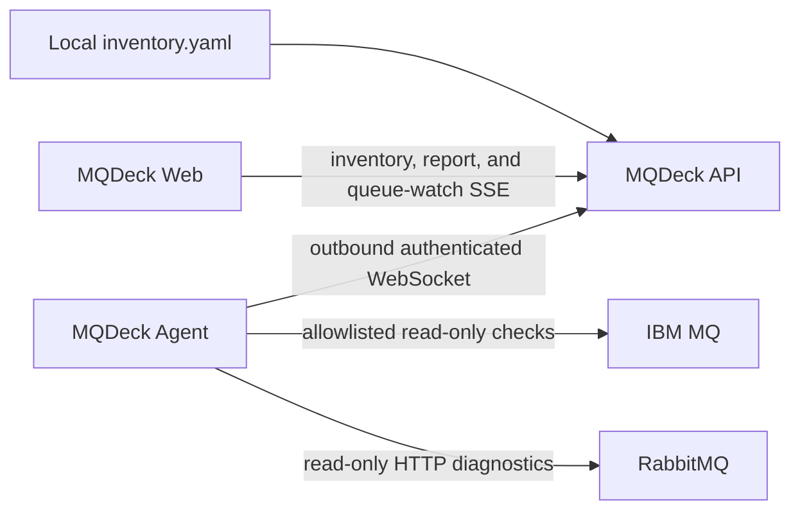

# MQDeck

MQDeck is a lightweight, read-only diagnostic console for IBM MQ and RabbitMQ.
Its inventory overview comes from a local YAML file and never probes brokers in
the background. An IBM MQ detail page uses three scoped tabs: Overview reads
only queue-manager status, while Queues and Channels request their respective
fresh, bounded data through a connected Agent.

The simplified architecture does not require Elasticsearch, scheduled
telemetry ingestion, retained observations, or Test Flight.

## Architecture

```mermaid
flowchart LR
    YAML["Local inventory.yaml"] --> API["MQDeck API"]
    WEB["MQDeck Web"] -->|"inventory, report, and queue-watch SSE"| API
    AGENT["MQDeck Agent"] -->|"outbound authenticated WebSocket"| API
    AGENT -->|"allowlisted read-only checks"| IBM["IBM MQ"]
    AGENT -->|"read-only HTTP diagnostics"| RMQ["RabbitMQ"]
```

The API chooses the `agent_id` named in the inventory, its
`default_agent_id`,
or an Agent selected in the broker detail page. Results are correlated in
memory, returned with their individual check evidence, and discarded.

Inventory entries can carry searchable tags and identify IBM MQ as
`distributed` or `zos`. Mainframe queue managers use the same IBM MQ client
transport, with optional CCDT and TLS key-repository settings for secured
enterprise channels.

## Components

- **Web**: static inventory overview, live Agent directory, on-demand reports,
  and an operator-enabled live queue-movement watch.
- **API**: YAML inventory and in-memory control plane.
- **Agent**: outbound WebSocket client and read-only diagnostic executor.

Complete example files are distributed with the API and Agent:

- `mqdeck-api/inventory.example.yaml`
- `mqdeck-agent/mqdeck.on-demand.example.yaml`

Each component is released and versioned independently. Download the required
version from the [API](https://github.com/mqdeck/mqdeck-api/releases),
[Agent](https://github.com/mqdeck/mqdeck-agent/releases), or
[Web](https://github.com/mqdeck/mqdeck-web/releases) repository. Optional
bundles in this repository contain only the component versions declared in
their `COMPONENTS.md` manifest.

Linux packages include a `systemd` unit and installer for RHEL-family systems.
Windows packages include a PowerShell service installer. Start with the
[component installation sequence](docs/installation-sequence.md). For an
existing installation, use the production [upgrade and rollback
guide](docs/upgrade.md).

Maintainers should follow the [independent component release
model](docs/releases.md); a delivery can contain one changed component or any
explicit combination of component versions.

The architecture and security decisions are documented in
[`docs/on-demand-architecture.md`](docs/on-demand-architecture.md).

## Safety model

The Agent validates every target received from the API. Queue Watch reuses the
same authenticated Agent connection and runs only the built-in IBM MQ queue
status collector. RabbitMQ uses `GET`
operations; IBM MQ command execution remains restricted to a single `DISPLAY`
MQSC command. The remote protocol cannot publish, consume, mutate broker state,
or execute arbitrary shell strings.

## License

MQDeck binaries are governed by the
[MQDeck Community Binary License 1.0](LICENSE.md).
