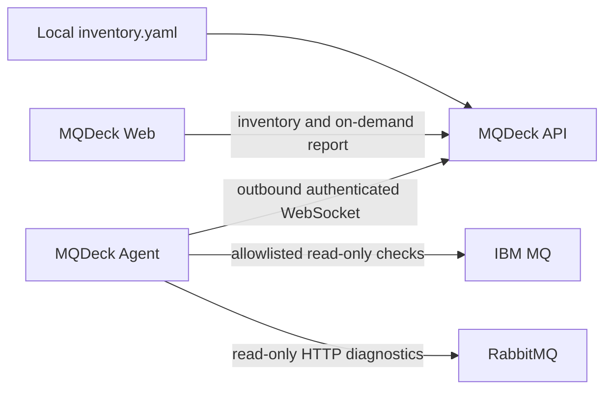

# MQDeck

MQDeck is a lightweight, read-only diagnostic console for IBM MQ and RabbitMQ.
Its overview comes from a local YAML inventory and never probes brokers in the
background. Opening a broker detail page asks a connected Agent to collect a
fresh, bounded diagnostic snapshot and returns it directly to the operator.

The simplified architecture does not require Elasticsearch, scheduled
telemetry ingestion, retained observations, or Test Flight.

## Architecture

```mermaid
flowchart LR
    YAML["Local inventory.yaml"] --> API["MQDeck API"]
    WEB["MQDeck Web"] -->|"inventory and on-demand report"| API
    AGENT["MQDeck Agent"] -->|"outbound authenticated WebSocket"| API
    AGENT -->|"allowlisted read-only checks"| IBM["IBM MQ"]
    AGENT -->|"read-only HTTP diagnostics"| RMQ["RabbitMQ"]
```

The API chooses the Agent named in the inventory, a configured default Agent,
or an Agent selected in the broker detail page. Results are correlated in
memory, returned with their individual check evidence, and discarded.

## Components

- **Web**: static inventory overview, live Agent directory, and on-demand reports.
- **API**: YAML inventory and in-memory control plane.
- **Agent**: outbound WebSocket client and read-only diagnostic executor.

Complete example files are distributed with the API and Agent:

- `mqdeck-api/inventory.example.yaml`
- `mqdeck-agent/mqdeck.on-demand.example.yaml`

Each component is released independently; there is no combined binary bundle.
Public, versioned component downloads are available under
[`github.com/mqdeck/mqdeck/releases/tag/v1.0.12`](https://github.com/mqdeck/mqdeck/releases/tag/v1.0.12).

Linux packages include a `systemd` unit and installer for RHEL-family systems.
Windows packages include a PowerShell service installer. Start with the
[component installation sequence](docs/installation-sequence.md). For an
existing installation, use the production [upgrade and rollback
guide](docs/upgrade.md).

The architecture and security decisions are documented in
[`docs/on-demand-architecture.md`](docs/on-demand-architecture.md).

## Safety model

The Agent validates every target received from the API. RabbitMQ uses `GET`
operations; IBM MQ command execution remains restricted to a single `DISPLAY`
MQSC command. The remote protocol cannot publish, consume, mutate broker state,
or execute arbitrary shell strings.

## License

MQDeck binaries are governed by the
[MQDeck Community Binary License 1.0](LICENSE.md).
