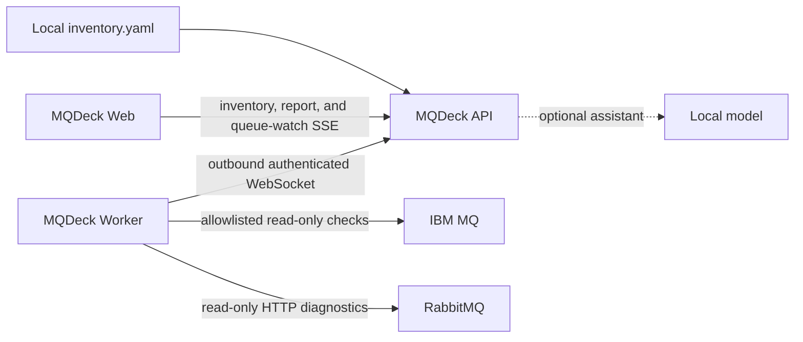

# MQDeck

MQDeck is a lightweight, read-only diagnostic console for IBM MQ and RabbitMQ.
Its inventory overview comes from a local YAML file and never probes brokers in
the background. An IBM MQ detail page uses three scoped tabs: Overview reads
only queue-manager status, while Queues and Channels request their respective
fresh, bounded data through a connected Worker.

The simplified architecture does not require Elasticsearch, scheduled
telemetry ingestion, retained observations, or Test Flight.

## Architecture

```mermaid
flowchart LR
    YAML["Local inventory.yaml"] --> API["MQDeck API"]
    WEB["MQDeck Web"] -->|"inventory, report, and queue-watch SSE"| API
    WORKER["MQDeck Worker"] -->|"outbound authenticated WebSocket"| API
    WORKER -->|"allowlisted read-only checks"| IBM["IBM MQ"]
    WORKER -->|"read-only HTTP diagnostics"| RMQ["RabbitMQ"]
    API -.->|"optional assistant"| MODEL["Local model"]
```

The local model is optional and sits next to the API. The Worker never calls it.
A collected report is sent to the model only when an operator asks the
assistant. Setup is in [`docs/llm.md`](docs/llm.md).

The API chooses the `worker_id` named in the inventory, its
`default_worker_id`,
or a Worker selected in the broker detail page. Results are correlated in
memory, returned with their individual check evidence, and discarded.

Inventory entries can carry searchable tags and identify IBM MQ as
`distributed` or `zos`. Mainframe queue managers use the same IBM MQ client
transport, with optional CCDT and TLS key-repository settings for secured
enterprise channels.

## Components

- **Web**: static inventory overview, live Worker directory, on-demand reports,
  Queue Watch, and an optional local assistant.
- **API**: YAML inventory, in-memory control plane, and optional model endpoint.
- **Worker**: outbound WebSocket client. Collection is read-only. The Channels
  tab can send one `START CHANNEL` command when an operator confirms it.

Copy the public templates in [`examples/`](examples/README.md):

- [`examples/inventory.yaml`](examples/inventory.yaml)
- [`packaging/systemd/worker.properties.example`](packaging/systemd/worker.properties.example)

Each component is versioned independently. Public install and upgrade packages
are always downloaded from this repository's
[releases](https://github.com/mqdeck/mqdeck/releases). Use the public release
tag for the download URL and the component versions listed in that release's
`COMPONENTS.md` for the archive names. Private component repositories are not
download sources for operators.

Linux packages include a `systemd` unit and installer for RHEL-family systems.
Windows packages include a PowerShell service installer. Start with the
[component installation sequence](docs/installation-sequence.md). For an
existing installation, use the production [upgrade and rollback
guide](docs/upgrade.md).

Maintainers should follow the [independent component release
model](docs/releases.md); a delivery can contain one changed component or any
explicit combination of component versions.

The architecture and security decisions are documented in
[`docs/on-demand-architecture.md`](docs/on-demand-architecture.md).
Optional on-prem model setup is documented in
[`docs/llm.md`](docs/llm.md).

## Safety model

The Worker validates every target received from the API. The Queues tab uses a
lightweight wildcard status inquiry for depth and open handles. Expanding one
IBM MQ queue performs one exact-name, read-only status inquiry. The API caches
that result for three seconds and coalesces simultaneous requests; expanding a
row does not start polling. Queue Watch starts only from **Start watch**, reuses
the authenticated Worker connection, and shares one sampler among viewers of
the same queue. The exact-name inquiry is
`DISPLAY QSTATUS(name) TYPE(QUEUE) CURDEPTH IPPROCS OPPROCS MONQ LPUTDATE LPUTTIME LGETDATE LGETTIME MSGAGE`.
MQDeck never enables `MONQ` or `STATQ`. The UI distinguishes monitoring being
off from no activity since queue-manager start. The default watch interval is five seconds
(`MQDECK_QUEUE_WATCH_INTERVAL`). RabbitMQ checks use `GET`.
IBM MQ collection uses one `DISPLAY` command per check. The only other MQSC
command is `START CHANNEL`, and only after an operator confirms it on the
Channels tab. The protocol cannot publish, consume, or run an arbitrary shell
command.

## License

MQDeck binaries are governed by the
[MQDeck Community Binary License 1.0](LICENSE.md).

## Trademarks and independence

IBM, IBM MQ, RabbitMQ, and other third-party names are used only to describe
compatibility. MQDeck is an independent product and is not affiliated with,
endorsed by, sponsored by, or supported by IBM, Broadcom, or any other
trademark owner. See [Third-party notices](THIRD_PARTY_NOTICES.md) for the
applicable attributions.
