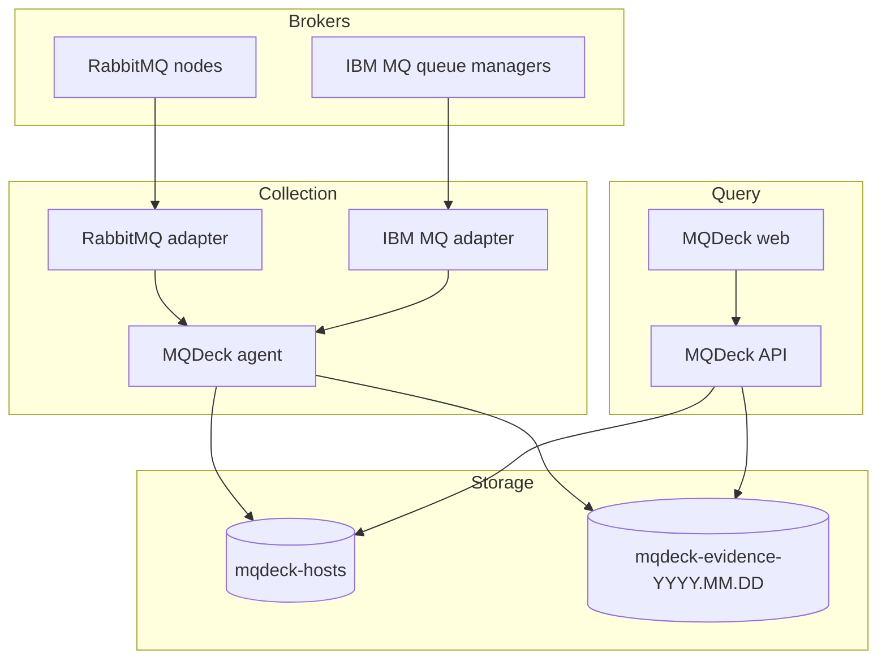

# Architecture

MQDeck separates evidence collection from the operator query path. This keeps
broker access narrow, makes collection independent of UI availability, and
allows the API to remain read-only.

## Data flow

The API is never part of ingestion. If the API or web interface is unavailable,
the agent can continue collecting evidence as long as Elasticsearch is
available.

## Component responsibilities

### Agent

The agent loads a strict YAML configuration, expands environment variables,
schedules checks, invokes the selected adapter, and writes two document types:

- current host snapshots in `mqdeck-hosts`;
- immutable evidence in daily `mqdeck-evidence-YYYY.MM.DD` indices.

Executions for the same job do not overlap. Global concurrency, request
timeouts, and maximum response sizes bound resource use.

Checks can be split into two capture tiers. Small `core` checks run frequently,
while larger `detail` checks run at a slower interval. For clustered RabbitMQ
deployments, a host can use the `report_source` label to reuse one cluster-wide
detail collection instead of indexing the same topology from every node.

### Adapters

Adapters isolate broker-specific transport, validation, and response handling.

- The RabbitMQ adapter supports the Management HTTP API and local diagnostic
  binaries. HTTP checks use relative `/api/` paths and `GET`; command checks
  are limited to allowlisted diagnostic subcommands.
- The IBM MQ adapter uses `runmqsc -c` over a client `SVRCONN` by default, so
  observation does not require `mqweb`. It also supports the Administrative
  REST API and local `runmqsc`. REST checks remain under the configured queue
  manager resource and use `GET`; MQSC checks must be one `DISPLAY` statement.

Both adapters reject known mutating operations before execution and enforce a
configured response-size limit.

### API

The API queries Elasticsearch with HTTP `GET`, including the supported
`GET /{index}/_search` form with a JSON request body. It exposes health, host,
evidence, and normalized report endpoints. It does not expose create, update,
delete, or ingestion endpoints.

The report layer combines the latest lightweight status with the latest detail
inventory and normalizes broker data into findings, queues, channels, clients,
topology, and message-flow views.

### Web interface

The web interface calls same-origin proxy routes, which forward read-only
requests to the API. It presents the host inventory and broker reports without
receiving telemetry directly from agents or brokers.

## Trust boundaries

1. Broker credentials are available only to the agent process and selected
   adapter.
2. Elasticsearch credentials are available to the agent and API, with write
   privileges required only by the agent.
3. The browser communicates with the web application, not directly with
   Elasticsearch or brokers.
4. Raw adapter responses are serialized into the evidence document's
   `data_json` field, avoiding dynamic mapping conflicts between heterogeneous
   broker payloads.
5. Before ingestion begins, the agent enforces an Elasticsearch ILM policy that
   removes MQDeck indices after six hours. The lifecycle remains active when
   MQDeck processes are offline.

Production deployments should additionally use TLS verification, least-
privilege service accounts, network segmentation, Elasticsearch access
controls, and review of the default six hour retention against local policy.
