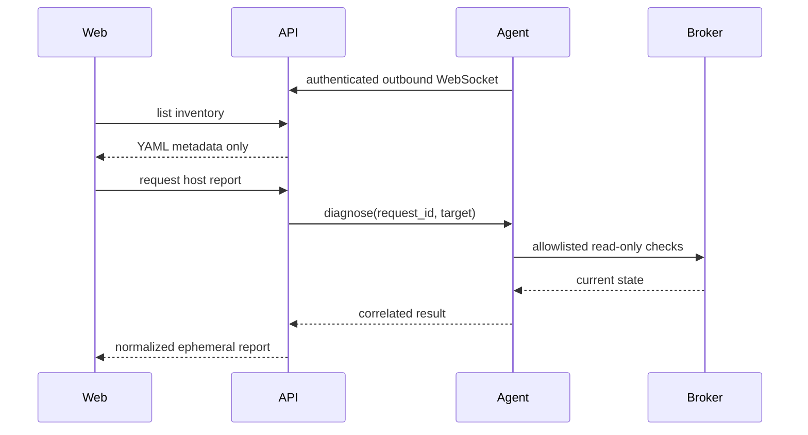

# Architecture

MQDeck separates inventory browsing from broker access.

```mermaid
sequenceDiagram
    participant Web
    participant API
    participant Agent
    participant Broker
    Agent->>API: authenticated outbound WebSocket
    Web->>API: list inventory
    API-->>Web: YAML metadata only
    Web->>API: request host report
    API->>Agent: diagnose(request_id, target)
    Agent->>Broker: allowlisted read-only checks
    Broker-->>Agent: current state
    Agent-->>API: correlated result
    API-->>Web: normalized ephemeral report
```

The API keeps connected Agents and pending requests in memory. It stores no
broker observations. Opening a detail page chooses the Agent explicitly named
by the inventory, the inventory default, a UI override, or the first available
Agent.

WebSocket over HTTPS was selected because the Agent must initiate a
bidirectional connection through ordinary firewalls and reverse proxies. At
the expected command volume, gRPC streaming would add protobuf and HTTP/2
operational complexity without a useful product benefit.

See [on-demand architecture](on-demand-architecture.md) for protocol and
security details.
