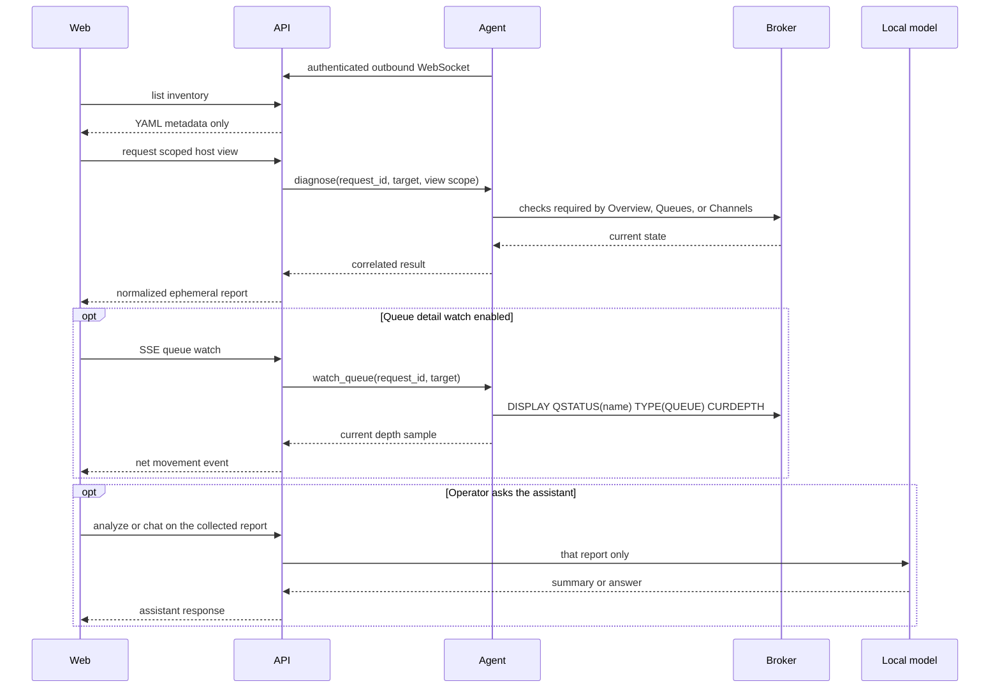

# Architecture

MQDeck separates inventory browsing from broker access.

```mermaid
sequenceDiagram
    participant Web
    participant API
    participant Agent
    participant Broker
    participant Model as Local model
    Agent->>API: authenticated outbound WebSocket
    Web->>API: list inventory
    API-->>Web: YAML metadata only
    Web->>API: request scoped host view
    API->>Agent: diagnose(request_id, target, view scope)
    Agent->>Broker: checks required by Overview, Queues, or Channels
    Broker-->>Agent: current state
    Agent-->>API: correlated result
    API-->>Web: normalized ephemeral report
    opt Queue detail watch enabled
      Web->>API: SSE queue watch
      API->>Agent: watch_queue(request_id, target)
      Agent->>Broker: DISPLAY QSTATUS(name) TYPE(QUEUE) CURDEPTH
      Agent-->>API: current depth sample
      API-->>Web: net movement event
    end
    opt Operator asks the assistant
      Web->>API: analyze or chat on the collected report
      API->>Model: that report only
      Model-->>API: summary or answer
      API-->>Web: assistant response
    end
```

The API keeps connected Agents and pending requests in memory. It stores no
broker observations. IBM MQ detail uses Overview, Queues, and Channels tabs;
each tab requests only the checks needed for that view. Overview performs only
the queue-manager status check. A request chooses the Agent explicitly named by
the inventory, the inventory default, a UI override, or the first available
Agent.

Queue Watch is off until the operator chooses **Start watch** on an expanded
IBM MQ queue. The snapshot rates and handles above that button do not contact
the queue manager again. While the watch is on, API to Web uses SSE and API to
Agent reuses the authenticated WebSocket. Each sample is
`DISPLAY QSTATUS(name) TYPE(QUEUE) CURDEPTH` only, every five seconds by
default (`MQDECK_QUEUE_WATCH_INTERVAL`). The watch does not enable queue
monitoring or statistics. The server keeps no sample history. **Stop watch**,
collapsing the queue, or leaving the page ends the stream. A browser session
also ends after ten minutes (`MQDECK_QUEUE_WATCH_MAX_DURATION`).

The local model is optional. With `MQDECK_LLM_ENABLED=auto` and no GGUF file,
the API still starts and the diagram's model step never runs. When a model is
ready, only an operator request sends the current report to it. The Agent is
not on that path. See [Local assistant and models](llm.md).

IBM MQ collection stays on `DISPLAY`. The Channels tab can also send
`START CHANNEL` for one named channel after the operator confirms it. That is
the only command that changes broker runtime state.

WebSocket over HTTPS was selected because the Agent must initiate a
bidirectional connection through ordinary firewalls and reverse proxies. At
the expected command volume, gRPC streaming would add protobuf and HTTP/2
operational complexity without a useful product benefit.

See [on-demand architecture](on-demand-architecture.md) for protocol and
security details.
