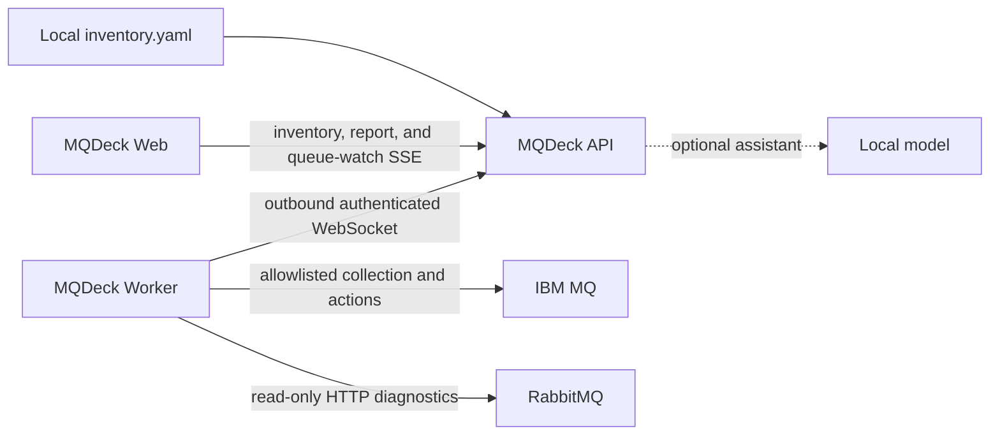

# Getting started

MQDeck lets you inspect an IBM® MQ queue manager or a RabbitMQ node when you
ask, and stays quiet the rest of the time. The inventory is a local file. A
connected Worker, placed in the broker network, runs the allowlisted check and
returns the result. Nothing is stored after the page responds. Separately
authorized actions can start or stop a named channel or run a temporary Queue
Watch session.

You install three small services. They do not need Elasticsearch, a scheduler,
or a telemetry database.

## How a request moves

This is the same picture as the repository README.

The Web page reads the inventory from the API without contacting a broker.
When you collect a host, the API sends that one request to the Worker named in
the inventory, the default Worker, or the Worker you pick on the page. The Worker
opens the connection outward. IBM MQ is reached with `runmqsc` over a
`SVRCONN`. RabbitMQ is reached with HTTP `GET`. The answer comes back on the
same WebSocket, is shown once, and is discarded.

Queue Watch, when you choose **Start watch**, reuses that Worker connection and
samples one queue with `CURDEPTH` plus last put, last get, and message age.
If the queue `MONQ` attribute is `OFF` or `QMGR`, the watch sets it to `LOW`
for that session and puts `OFF` or `QMGR` back when the watch stops. It does
not change queue statistics or the queue manager `MONQ`.

The dotted line is the optional local model. It runs on the API host, or at an
OpenAI-compatible URL you configure. The Worker does not load a model. Broker
data reaches the model only after you open **Show findings** and ask the
assistant. Inventory, collection, and Queue Watch work with no model installed.
See [Local assistant and models](llm.md).

## What you will use

| Piece | Where it runs | What it does |
| --- | --- | --- |
| [API](install-api.md) | A host the operators and Workers can reach | Holds `inventory.yaml` and routes each request |
| [Web](install-web.md) | Next to the API, or behind your reverse proxy | Login, inventory, and the host pages |
| [Worker](install-worker-linux.md) | Inside each broker network zone | Executes allowlisted collection and actions. No inbound port |

Put the Worker on Linux or [Windows](install-worker-windows.md), wherever
`runmqsc` or the RabbitMQ management API is reachable. One Worker can serve
every queue manager in its zone. Use another Worker only when the network path
is different.

Packages come from [MQDeck releases](https://github.com/mqdeck/mqdeck/releases).
The download URL uses the public release tag (`MQDECK_VERSION`). The archive
name uses the component version in that release's `COMPONENTS.md`.

## Install

On RHEL-family Linux, download the package, run its installer as root, review
`/etc/mqdeck`, validate, and start the service. On Windows, the package
includes a PowerShell installer that creates the service.

Install in this order:

1. [API](install-api.md), then confirm `GET /healthz`.
2. [Web](install-web.md), then sign in. For corporate access, continue with
   [Microsoft Entra ID SSO and role mapping](identity-and-access.md).
3. [Worker on Linux](install-worker-linux.md) or [Worker on Windows](install-worker-windows.md), then confirm it appears in the Worker list.

Copy [examples/inventory.yaml](../examples/inventory.yaml) as the shape of the
API inventory and `/etc/mqdeck/worker.properties` as the Worker
connection. Replace every example address and password with a literal value.
The API does not expand `${...}` placeholders.

## First look

1. Open the inventory. That page lists hosts from the file and does not contact a broker.
2. Open a host and choose **Collect data**. IBM MQ loads Overview first. Queues and Channels load when you open those tabs.
3. Expand a local IBM MQ queue for one current, exact-name status inquiry. It shows depth, handles, and last put/get. Choose **Start watch** only when you want repeated samples. That watch can turn queue `MONQ` to `LOW` until you stop it.
4. On an inactive IBM MQ channel, **Start** sends `START CHANNEL` through the
   selected Worker. Administrators can also stop a running channel with
   `STOP CHANNEL ... MODE(QUIESCE)`. Both actions require confirmation and are
   checked by the server.
5. Administrators can configure [SSO, group mappings, and local users](identity-and-access.md), replace the complete YAML in **Settings → Inventory**, and review persisted actions in **Audit**. A valid inventory replacement becomes active without restarting the API.
6. The [local assistant](llm.md) is optional. Reports and Queue Watch work without a model.

The [installation sequence](installation-sequence.md) is the short verification
path. Settings live in the [configuration reference](configuration.md). An
existing install follows [upgrade and rollback](upgrade.md). The design notes
are in [on-demand architecture](on-demand-architecture.md).

IBM and IBM MQ are trademarks or registered trademarks of International
Business Machines Corporation. MQDeck is independent and is not affiliated
with or endorsed by IBM. See [Trademarks and product independence](../TRADEMARKS.md).
