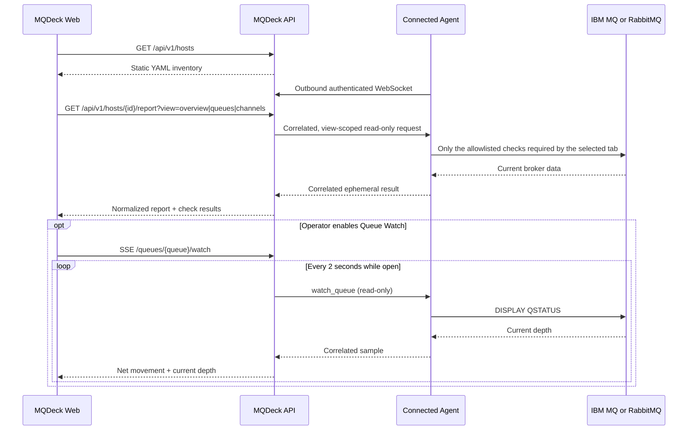

# MQDeck on-demand architecture

## Product definition

MQDeck is a read-only, on-demand diagnostic console for IBM MQ and RabbitMQ.
It keeps a small local YAML inventory and contacts a broker only when an
operator opens a broker tab or explicitly requests a refresh. IBM MQ collection
is scoped by tab: Overview reads only queue-manager state, Queues reads queue
definitions and status, and Channels reads channel definitions and status.

MQDeck is no longer a telemetry, time-series, or synthetic-transaction
platform. Elasticsearch, scheduled broker collection, retained observations,
and Test Flight are outside the simplified product.

## Runtime flow



The inventory overview never contacts a broker. Inside an IBM MQ detail page,
the Overview tab runs only the lightweight queue-manager check; queue and
channel inventories are not requested until their tabs are opened. Each request
uses the `agent_id` named on the inventory entry, the configured
`default_agent_id`, or
an agent selected by the operator. If none is specified, the API selects an
available connected agent.

Queue Watch is the first, collapsed section in queue details. It is deliberately
opt-in and expands only after the operator enables it; it exists only while its
queue detail accordion remains open. The browser receives one-way Server-Sent Events (SSE),
which is simpler than another bidirectional browser socket for telemetry. API
to Agent traffic continues over the existing authenticated WebSocket. Each
sample runs only the allowlisted queue-status check; closing the accordion or
disabling the switch cancels the stream. Navigating away or expanding another
queue also unmounts the active watch, closes its EventSource, propagates the
request cancellation through Web, and releases the API watch slot.

Incoming and outgoing values represent net depth movement between samples.
Simultaneous puts and gets can offset one another, so Queue Watch is an
immediate operational signal rather than an accounting counter.

## Why WebSocket instead of gRPC

The Agent needs a long-lived, bidirectional connection initiated from inside
the network. WebSocket over HTTPS provides that channel through common reverse
proxies and firewalls, uses the API's existing port, and has a small operational
surface. gRPC streaming would also work, but adds HTTP/2 proxy requirements,
protobuf contracts, code generation, and another deployment concern without a
clear benefit at the expected command volume.

Each message has a type and request ID. The API correlates responses in memory
and applies a bounded timeout. Reconnect is automatic. Only live agents are
selectable.

## State and persistence

- `inventory.yaml` is the source of truth for broker metadata and routing.
- Inventory tags and IBM MQ platform (`distributed` or `zos`) are static
  metadata; cluster roles and operational state still come from the broker.
- Agent presence, outstanding requests, and diagnostic results exist in memory.
- Results are returned to the requesting browser and are not retained.
- Queue Watch samples and session totals are not retained.
- The inventory is self-contained and does not expand environment variables.
  Restrict its filesystem permissions because it contains the credentials the
  Agent needs for read-only diagnostics.

## Security boundary

- Agents initiate the connection; no inbound Agent port is needed.
- The WebSocket handshake requires a bearer token and must use TLS outside a
  trusted development machine.
- The Agent revalidates every received target before execution.
- Existing adapter allowlists still restrict IBM MQ to `DISPLAY` operations and
  RabbitMQ to read-only HTTP/diagnostic operations.
- IBM MQ TLS and enterprise client policies use a CCDT on the selected Agent;
  MQDeck passes only `MQCCDTURL` and optional `MQSSLKEYR` to `runmqsc`.
- Arbitrary shell strings, MQSC mutations, publishing, consuming, and Test
  Flight operations are not part of the control protocol.
- Queue names are validated, bounded, and never interpolated into arbitrary
  MQSC. The Agent selects its fixed `queue_status` collector.

## Configuration

API:

```dotenv
MQDECK_INVENTORY_PATH=/etc/mqdeck/inventory.yaml
MQDECK_AGENT_TOKEN=replace-with-a-long-random-secret
MQDECK_DIAGNOSTIC_TIMEOUT=45s
```

Agent:

```yaml
version: 1
agent:
  id: network-zone-a
  name: Agent Sao Paulo
  location: sa-east-1
  max_concurrency: 4
control_plane:
  url: https://mqdeck.example.com
  token: ${MQDECK_AGENT_TOKEN}
  reconnect_delay: 5s
```

See `mqdeck-api/inventory.example.yaml` and
`mqdeck-agent/mqdeck.on-demand.example.yaml` for complete examples.
