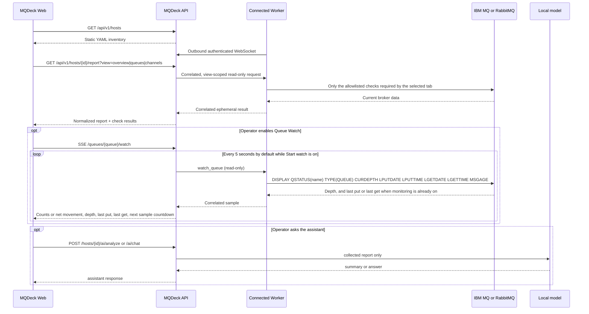

# MQDeck on-demand architecture

## Product definition

MQDeck is a read-only, on-demand diagnostic console for IBM MQ and RabbitMQ.
It keeps a small local YAML inventory and contacts a broker only when an
operator opens a broker tab or explicitly requests a refresh. IBM MQ collection
is scoped by tab: Overview reads only queue-manager state, Queues reads queue
definitions and status, and Channels reads channel definitions and status.

MQDeck is no longer a telemetry, time-series, or synthetic-transaction
platform. Elasticsearch, scheduled broker collection, retained observations,
and Test Flight are outside the simplified product. An optional local model
can read a report after the operator asks. It is not on the Worker path and it
is not required for inventory, collection, or Queue Watch. See
[Local assistant and models](llm.md).

## Runtime flow



The inventory overview never contacts a broker. Inside an IBM MQ detail page,
the Overview tab runs only the lightweight queue-manager check; queue and
channel inventories are not requested until their tabs are opened. Each request
uses the `worker_id` named on the inventory entry, the configured
`default_worker_id`, or
an worker selected by the operator. If none is specified, the API selects an
available connected worker.

Expanding a local IBM MQ queue shows the snapshot already collected for that
tab: depth, rates, and open handles. That view does not start Queue Watch.
The operator starts it with **Start watch** and stops it with **Stop watch**.
RabbitMQ queues do not offer Queue Watch.

While the watch is on, the browser receives one-way Server-Sent Events (SSE).
API to Worker traffic stays on the existing authenticated WebSocket. Each sample
is only:

```text
DISPLAY QSTATUS(queue-name) TYPE(QUEUE) CURDEPTH LPUTDATE LPUTTIME LGETDATE LGETTIME MSGAGE
```

The command names one queue. It does not request application handles, and it
does not change `MONQ` or `STATQ`. If those switches are off, they stay off.
Last put, last get, and message age come back on this same inquiry only when
monitoring is already enabled. The live label counts down the configured
interval until the next sample. Enqueue and dequeue counts are the depth
change when only one side moved. When put and get both move in the same
interval, the chart keeps the net change instead of inventing a split.

Clients watching the same Worker, inventory host, and queue share one sampler
and therefore one IBM MQ command per interval. The default interval is five
seconds (`MQDECK_QUEUE_WATCH_INTERVAL`). Each browser session expires after ten
minutes (`MQDECK_QUEUE_WATCH_MAX_DURATION`). **Stop watch**, collapsing the
queue row, opening another queue, or leaving the page closes the EventSource,
cancels the Worker request, and releases the API watch slot. Sampler limits
apply globally, per Worker, and per queue manager.

Enqueue and dequeue are message counts for the sample, not a rounded rate.
A single message is kept even when the interval is longer than one second.
Simultaneous puts and gets can still offset one another, so Queue Watch is an
immediate operational signal rather than an accounting counter.

## Why WebSocket instead of gRPC

The Worker needs a long-lived, bidirectional connection initiated from inside
the network. WebSocket over HTTPS provides that channel through common reverse
proxies and firewalls, uses the API's existing port, and has a small operational
surface. gRPC streaming would also worker, but adds HTTP/2 proxy requirements,
protobuf contracts, code generation, and another deployment concern without a
clear benefit at the expected command volume.

Each message has a type and request ID. The API correlates responses in memory
and applies a bounded timeout. Reconnect is automatic. Only live workers are
selectable.

## State and persistence

- `inventory.yaml` is the source of truth for broker metadata and routing.
- Inventory tags and IBM MQ platform (`distributed` or `zos`) are static
  metadata; cluster roles and operational state still come from the broker.
- Worker presence, outstanding requests, and diagnostic results exist in memory.
- Results are returned to the requesting browser and are not retained.
- Queue Watch samples and session totals are not retained.
- Queue Watch is an interactive diagnostic aid, not a permanent monitoring or
  accounting feed. IBM MQ events and statistics remain the appropriate source
  for long-running alerts and throughput history.
- The inventory is self-contained and does not expand environment variables.
  Restrict its filesystem permissions because it contains the credentials the
  Worker needs for read-only diagnostics.

## Security boundary

- Workers initiate the connection; no inbound Worker port is needed.
- The WebSocket handshake requires a bearer token and must use TLS outside a
  trusted development machine.
- The Worker revalidates every received target before execution.
- IBM MQ collection is limited to one `DISPLAY` command per check. The Channels
  tab may send `START CHANNEL(name)` after the operator confirms it. RabbitMQ
  stays on read-only HTTP checks.
- IBM MQ TLS and enterprise client policies use a CCDT on the selected Worker;
  MQDeck passes only `MQCCDTURL` and optional `MQSSLKEYR` to `runmqsc`.
- The control protocol does not publish, consume, run a shell string, or accept
  arbitrary MQSC. `START CHANNEL` is the only runtime change, and it is sent
  only for the channel name the operator confirmed.
- Message browse is a separate operator action on one local queue. It reads at
  most 10 messages from the front of the queue and then stops. It does not
  walk to the end of the queue and does not write a dump file. IBM MQ uses one
  non-destructive browse. RabbitMQ uses the management API with
  `ack_requeue_true`, so the message stays and is marked redelivered. Browse
  does not run on expand and is not retained.
- Queue names are validated, bounded, and never interpolated into arbitrary
  MQSC. The Worker selects its fixed `queue_status` collector.

## Configuration

API, in `/etc/mqdeck/api.properties`:

```properties
mqdeck.inventory.path=/etc/mqdeck/inventory.yaml
mqdeck.worker.token=replace-with-a-long-random-secret
mqdeck.diagnostic.timeout=90s
```

A container sets the same values as `MQDECK_INVENTORY_PATH`, `MQDECK_WORKER_TOKEN`, and `MQDECK_DIAGNOSTIC_TIMEOUT`. The environment variable wins when both are present.

Worker, in `/etc/mqdeck/worker.properties`:

```properties
mqdeck.worker.id=network-zone-a
mqdeck.worker.name=Worker Sao Paulo
mqdeck.worker.location=sa-east-1
mqdeck.worker.max.concurrency=4
mqdeck.worker.command.timeout=60s
mqdeck.api.url=https://mqdeck.example.com
mqdeck.worker.token=replace-with-the-same-api-token
mqdeck.worker.reconnect.delay=5s
```

See [examples/inventory.yaml](../examples/inventory.yaml) for the broker inventory template.
